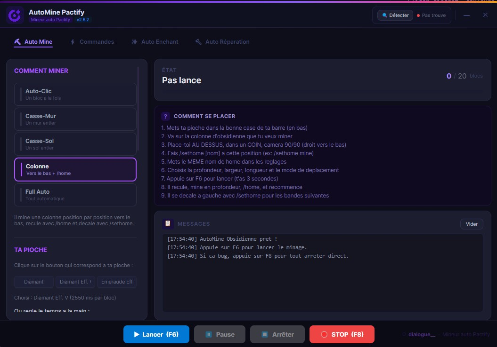
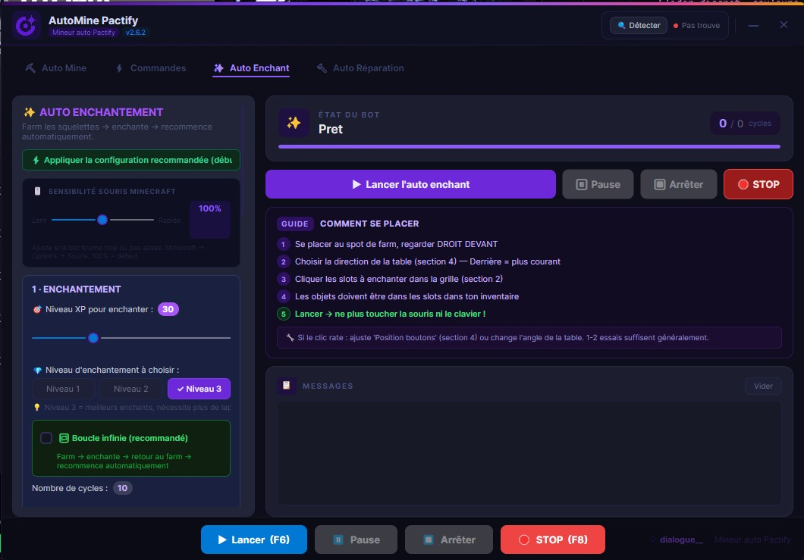
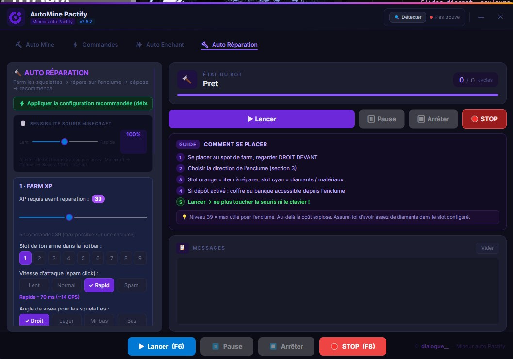
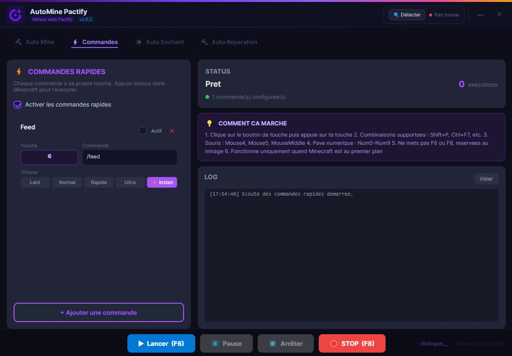

# ⛏️ AutoMine Pactify

Bot de minage et d'automatisation pour le serveur **Pactify**.

## 📥 Téléchargement

Télécharge la dernière version dans l'onglet **[Releases](../../releases/latest)**.

> Fichier : `AutoMinePactify.exe` — aucune installation requise.

---

## 🎯 Fonctionnalités

### ⛏️ Auto Mine
Mine automatiquement l'obsidienne en colonnes avec `/home` et `/sethome`. Plusieurs modes disponibles : Auto-Clic, Casse-Mur, Casse-Sol, Colonne et Full Auto.

---

### ✨ Auto Enchant
Farm les squelettes jusqu'au niveau XP cible, enchante automatiquement l'objet dans la table, puis retourne au spot de farm et recommence en boucle.

---

### 🔨 Auto Réparation
Farm les squelettes jusqu'au niveau 39, répare l'item sur l'enclume avec les diamants configurés, puis dépose dans un coffre ou via `/bank` — tout en boucle.

---

### ⚡ Commandes Rapides
Exécute des commandes chat Minecraft avec des raccourcis clavier personnalisés. Supporte les combinaisons `Shift+P`, `Ctrl+F7`, les touches souris, le pavé numérique, etc.

---

## 🕹️ Utilisation

1. Lance `AutoMinePactify.exe` (en administrateur)
2. Entre ta clé de licence lors de la première utilisation
3. Configure tes paramètres selon le module voulu
4. Place-toi correctement dans Minecraft
5. Appuie sur **F6** pour démarrer / mettre en pause
6. **F8** pour arrêt d'urgence

## 🔑 Licence

Une clé de licence est nécessaire pour utiliser le programme.  
Contacte le vendeur pour obtenir ta clé.

## 📋 Changelog

Voir les [Releases](../../releases) pour l'historique des versions.

---

*by dialogue__*
